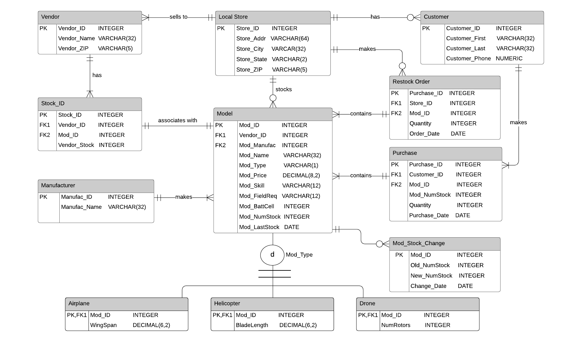

# SQL-RC-database
 An entire PostgreSQL database built from the ground up for storing RC characteristics and features in an arbitrary
 "Local Store", that allows customer pick-up orders and re-stocking orders from "Vendors".  The SQL script 
 `build_database.sql` is re-runnable in its entirety so that the database can be easily brought up on 
 your own PGAdmin server; `queries.sql` are some suggested queries to pull relevant data from the database 
 in a generalized use case scenario.
 
### Project Overview
 - 11 tables with FK/PK's and relationships (Crow's-foot design)
 - DROP TABLE statements (whole build_database.sql is re-runnable)
 - Full Entity-Relationship Diagram
 - Foreign Keys
 - Indexes, although unnecessary until there is more data loaded
 - Specialization-Generalization Relationship
 - < 10 RC models included (more to be added, probably via spreadsheets)
 - Triggers & Stored Procedures for a few cases that this DB would encounter in regular use
 
 ### Docs
[Direct link to PDF](./docs/SQL_RC_DB_paper.pdf)

 There is a very comprehensive docs file in the form of a PDF located in `./docs` which I have linked above.  It includes a 
 description for many of this DB's general design and specific concepts that were taken into consideration
 while building it.  It also contains a data dictionary, use cases, and sample screenshots of PGAdmin
 results based on the triggers, queries, and stored procedures.
 

 
 ### Entity-Relationship Diagram (ERD):
 

